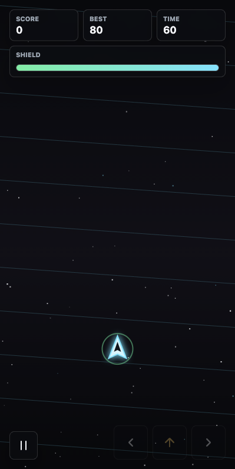

# Orbit Runner

A fast-paced, 60-second arcade survival game built with vanilla HTML5 Canvas, CSS and JavaScript. No build tools, no frameworks — just open `index.html` and play.



## Play online

Once GitHub Pages is enabled for this repo (see **Deployment** below), the latest build is published at:

`https://<your-username>.github.io/Orbit-Runner/`

## Gameplay

You pilot a small ship drifting through an asteroid field. You have **60 seconds** to score as many points as possible by collecting shards, grabbing power-ups, and dodging meteors. When the clock runs out — or your shield breaks — the run ends and you're graded from **D** to **S**.

### Pickups

| Icon | Name | Effect |
| --- | --- | --- |
| Diamond (cyan/mint/amber/violet) | Shard | +points, builds combo |
| Star (gold) | Golden Shard | Big points, counts toward combo |
| Circle + cross (mint) | Energy Cell | Repairs shield, small points |
| Lightning (amber) | Speed Boost | 4 s of extra thrust |
| Magnet (pink) | Magnet | 6 s of shard attraction |
| Bomb (violet) | Bomb | Stocks a bomb — press **B** to clear meteors |
| Jagged rock | Meteor | Damages shield on contact |

### Combos & grading

- Every shard you pick up increases your combo by 1.
- A combo multiplier boosts points until you miss a shard or take damage.
- Final grade is based on total score: S (>=800), A (>=500), B (>=300), C (>=150), D otherwise.

## Controls

### Keyboard

- **WASD** or **Arrow keys** — steer
- **Space / Enter** — start, pause, resume
- **B** — detonate a bomb (clears nearby meteors)
- **M** — toggle sound

### Touch / mouse

- On-screen left, right and thrust buttons at the bottom-right.
- Tap or drag anywhere on the canvas to pull the ship toward the pointer.
- Tap the pause button in the top-right to pause / resume.

## Features

- Three difficulties: Easy / Normal / Hard
- Wave announcements every 15 seconds
- Pickups: energy cells, speed boost, magnet, bomb, golden shards
- Persistent best score and settings via `localStorage`
- Local top-5 leaderboard on the result screen
- Accessible: keyboard controls, reduced-motion respect, ARIA labels
- Fully responsive, PWA-installable (has manifest + theme color)
- Zero dependencies — pure HTML/CSS/JS

## Run locally

```bash
# Any static server works. For example:
npx serve .
# or
python3 -m http.server 8080
```

Then open <http://localhost:8080>.

You can also just double-click `index.html`, although some browsers restrict the Web Audio API until you open it via `http://`.

## Deployment

The repository ships with a GitHub Actions workflow at `.github/workflows/deploy.yml` that publishes the site to GitHub Pages on every push to `main`.

To enable it:

1. Go to **Settings → Pages** in GitHub.
2. Set **Source** to **GitHub Actions**.
3. Push to `main` — the workflow will build and deploy.

## Project structure

```
.
├── index.html              # Markup and HUD
├── styles.css              # All styling
├── game.js                 # Game loop, rendering, input, audio
├── manifest.webmanifest    # PWA manifest
├── favicon.svg             # Scalable icon
├── orbit-runner-smoke.png  # Screenshot
└── .github/workflows/      # CI: deploy to GitHub Pages
```

## License

MIT — see [LICENSE](LICENSE).
